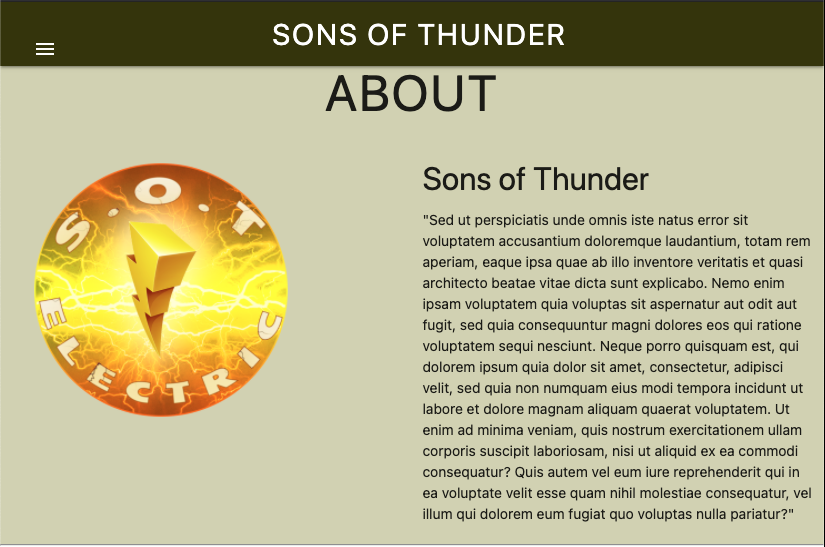
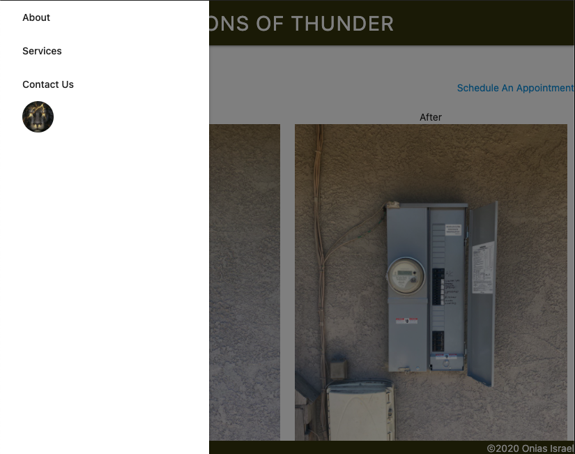
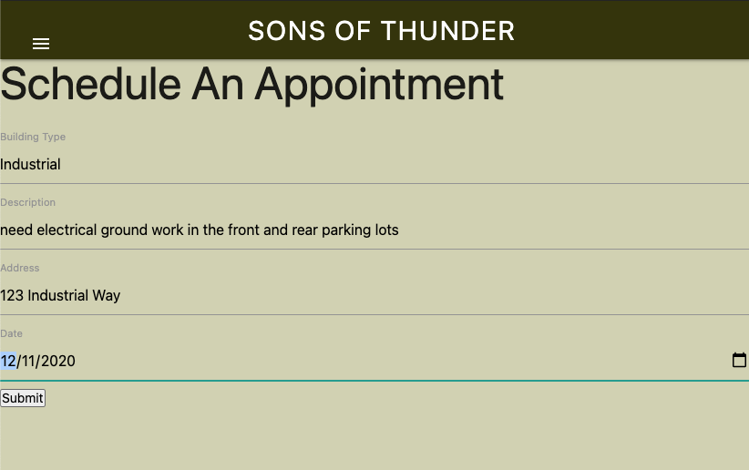
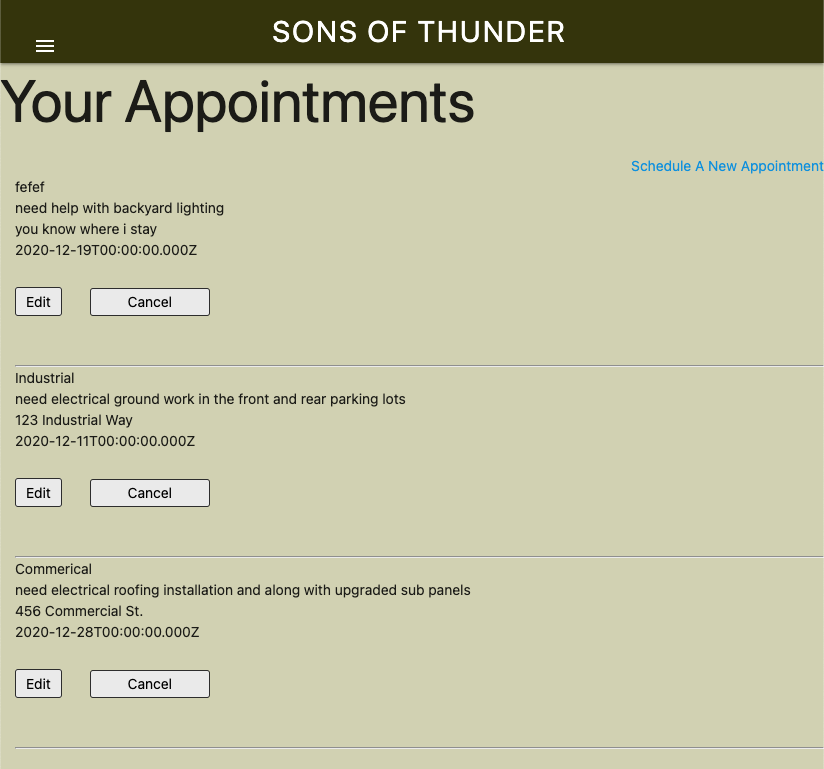
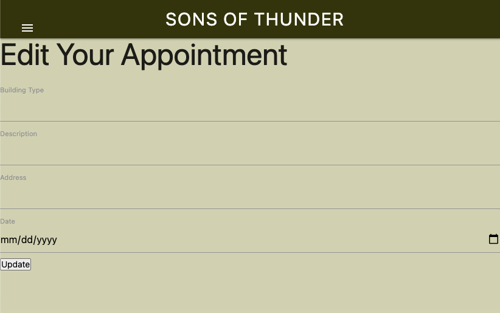

# Sons of Thunder

## What is SOT: Electric?

Sons of Thunder: Electric is an electrician business app where users can visit and schedule appointments to receive a wide variety of electrical services for thier residential, commercial and/or industrial buildings. Users can create a profile to schedule, review, edit, reschedule and cancel existing appointments.

## Technologies Used
* Mongoose
* Express
* React.js
* Node
* HTML
* CSS
* Materialize
* Adobe Photoshop

## Installation Steps
(The following dependencies were installed to create this app)
#### Front End
* auth0-react
* materialize-css
* materialize-social
* react-dom-router
* react-json-pretty
* react-materialize

#### Back End 
* body-parser
* cors
* dotenv
* express
* mongoose

## User Stories / Wireframes
#### Users can read about the company, view the services provided, and find the contact information once they land on the home page.

#### Users can navigate through the home page and login in to their profile.

#### Users can schedule an appointment.

#### Users can view and cancel their appointments.

#### Users can edit and reschedule thier appointments.

## Entity Relationship Diagrams
This app has a one to many relationship where users can create a profile and schedule multiple appointments.

## Unsolved Problems
* add time to appointment model
* add website tab icon
* dropdown for building types
* format date on front end
* link auth0 user to the appointment model
* prepopulate existing form when editing
* styling

## Future Features
* add Google Maps API
* add reviews and ratings of service
* add warning modal when cancelling an appointment
* add warning when canceling appointment
* authorization for owner of website to view specific pages and info
* autofill address input
* block out dates and times not availble
* carousel for before/after pictures
* make spanish verison
* save history of previous appointments
* send email to owner once a user schedules an appointment
